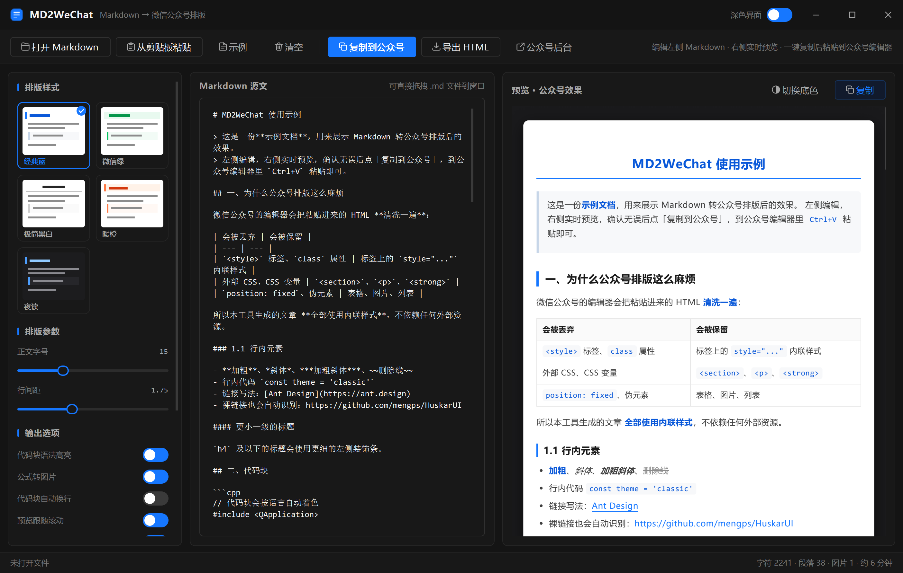

<div align="center">

# MD2WeChat

**Markdown → 微信公众号排版器**

把 Markdown 变成可以直接粘贴进公众号编辑器的排版
纯本地运行 · 不依赖任何第三方服务 · 公式离线渲染

[功能特性](#-功能特性) · [技术实现](#-技术实现) · [使用方法](#-使用方法) · [从源码构建](#-从源码构建)



</div>

---

## 这是什么

写技术文章的人大多用 Markdown，但公众号编辑器不认 Markdown，也不认标准 HTML ——
它会把 `<style>`、`class` 属性、外部 CSS 全部清掉，**只保留标签上的 `style="..."`**。

**MD2WeChat** 在本地把 Markdown 转成「公众号友好的 HTML」：
全部内联样式、容器统一用 `<section>`、图片全部内联。点一下「复制到公众号」，
到公众号编辑器里 `Ctrl+V` 即可。

纯 C++ / Qt 实现，**不调用任何网页接口、不依赖任何第三方排版服务**，
你的内容不会经过别人的服务器。

## ✨ 功能特性

**Markdown 全要素支持**

标题 · 段落 · 加粗 · 斜体 · 加粗斜体 · 删除线 · 行内代码 · 链接 · 图片 ·
引用（含嵌套）· 有序 / 无序列表（含嵌套）· 任务列表 · 表格（含对齐）·
分割线 · 围栏代码块 · 引用式链接 · 原始 HTML 片段

**数学公式（离线渲染）**

- `$...$`、`$$...$$`、`\(...\)`、`\[...\]` 四种写法
- 内置 MathJax 3，渲染成 3 倍超采样 PNG 后内联
- **不依赖任何外部服务，断网可用**
- 行内公式按基线自动对齐

**中文排版习惯**

- 段首 `$\qquad$` / `$~$` / `&emsp;` 自动转成 `text-indent:2em` 首行缩进
- `::: hljs-center` / `hljs-right` / `hljs-left` 容器，内容按图注排版
- 图片 alt 是文件名时（如 ``）不当作图注显示

**代码块**

- 自研语法着色器：C / C++ / Java / C# / JS / TS / Python / Go / Rust /
  PHP / Swift / Kotlin / SQL / JSON / Bash / YAML / HTML / XML…
- 可选横向滚动（保留原始换行）或自动换行（适配手机屏）

**图片不丢**

- 本地图片自动转 Base64
- 远程图片（图床 / 自己的 OSS / MinIO）预下载后内联
  —— 即使对方 `Content-Type` 不是 `image/*`、微信抓不到，也不会「图片载入失败」

**一键复制**

- 标准 `CF_HTML` + 可读纯文本双格式
- 复制前自动等待公式渲染、图片下载完成

**界面**

- 无边框窗口、自绘标题栏，Ant Design 风格（对齐 HuskarUI 设计变量）
- 5 套排版主题：经典蓝 / 微信绿 / 极简黑白 / 暖橙 / 夜读
- 浅色 / 深色界面一键切换
- 编辑器 ↔ 预览双向滚动同步
- 窗口尺寸、分辨率自适应

## 🧩 技术实现

### 1. 为什么所有样式都是内联的

公众号编辑器对粘贴内容有一套「清洗」规则，本工具生成的 HTML 从设计上就不含会被丢弃的部分：

| 微信会丢弃 | 微信会保留 |
| --- | --- |
| `<style>` 标签、`class` 属性 | 标签上的 `style="..."` 内联样式 |
| 外部 CSS、CSS 变量 | `<section>`、`<p>`、`<strong>` |
| `position: fixed`、伪元素 | 表格、图片、列表 |

实测剪贴板载荷：`styleTag=0  classAttr=0` —— 一个 `<style>` 和一个 `class` 都没有。

### 2. 自研 Markdown 解析器

`src/MarkdownParser.cpp`，不依赖任何第三方库。

只做**结构识别**、不做内容改写 —— 产物是块级 AST，行内解析在渲染阶段做，保证原文一字不改。
支持容器语法（`::: name`）、任务列表、引用式链接、以及 `$...$` / `$$...$$` 数学定界。

### 3. 公式渲染管线

公众号不支持 MathJax / MathML，**公式必须是图片**。管线：

```
$...$ / $$...$$
   → 内置 MathJax 3 (tex-svg) 输出 SVG
   → Blob → canvas 3 倍超采样 → PNG dataURI
   → 缓存, 渲染时替换为 
```

几个关键点：

- MathJax SVG 的 `viewBox` 单位是 **1000 = 1em**，尺寸按 `px = viewBox宽 / 1000 × 字号` 换算；
  行内公式的基线下沉量 = `-viewBox.minY / 1000 × 字号`
- SVG 里的 `fill="currentColor"` 要在序列化前显式设置颜色，否则会变黑
- `QWebEngineView::loadFinished` 会先为 `about:blank` 触发一次，
  必须确认页面真正就绪后再启动转换
- 大体积 JS 不要内联进 `setHtml()`（会破坏文档解析），释放到临时目录用 `file://` 引入

### 4. 剪贴板：手工拼 CF_HTML

Qt 的 `QMimeData::setHtml()` 由 Qt 代为构造 Windows 的 CF_HTML，行为不完全可控。
这里自己拼，四个偏移（`StartHTML` / `EndHTML` / `StartFragment` / `EndFragment`）
按 **UTF-8 字节偏移**计算、固定 10 位右补零，先占位再回填，然后用 Win32 API
`SetClipboardData(RegisterClipboardFormat("HTML Format"))` 落盘。

**纯文本兜底也做了处理**：接收方一旦退回纯文本格式，给的是渲染后的可读正文
（`md::htmlToPlainText`），而不是 Markdown 原文 —— 否则粘出来的就是一堆 `#` 和 ``。

### 5. 滚动同步

网页滚动事件没有直接的 C++ 信号。这里重写
`QWebEnginePage::javaScriptConsoleMessage`，预览页脚本把滚动比例
`console.log("md2wx:scroll:0.42")` 出来，C++ 解析 —— 比 QWebChannel 少一个要分发的脚本文件。

双向联动用一个 220ms 的时间锁防止两栏互相推着抖。

### 6. 图片内联

本地图片读文件转 Base64；远程图片用 `QNetworkAccessManager` 预下载后内联
（单图上限 4MB，失败的保留原链接）。内联后微信**完全不需要去抓外链** ——
对方服务器 `Content-Type` 不对、被墙、或者限流，都不影响。

## 🚀 使用方法

**三步发布**

1. 点工具栏 **复制到公众号**（会自动等公式渲染、图片下载完成）
2. 点 **公众号后台**（直接打开 mp.weixin.qq.com），登录后新建图文消息
3. 光标放在**正文区域**，`Ctrl+V`

**界面说明**

| 区域 | 说明 |
| --- | --- |
| 左侧 · 排版样式 | 5 套预设主题，点击切换 |
| 左侧 · 排版参数 | 正文字号、行间距 |
| 左侧 · 输出选项 | 语法高亮 / 公式转图片 / 代码块自动换行 / 预览跟随滚动 / 图片内联 等 |
| 中间 · Markdown 源文 | 直接编辑，或把 `.md` 文件拖进窗口 |
| 右侧 · 预览 | 677px 公众号正文宽度，所见即所得 |

**Markdown 写法提示**

````markdown
$\qquad$段落以 `$\qquad$` 开头会变成首行缩进两字符。


::: hljs-center
图注用 hljs-center 包起来，会自动居中并使用小一号浅色字
:::

$$
|V_{grid}| > 30V
$$
````

## 🔨 从源码构建

**依赖**

| 组件 | 说明 |
| --- | --- |
| Qt | 5.15.x，**MSVC 构建**（不是 MinGW）|
| 编译器 | MSVC v142 / v143（Visual Studio 2019 / 2022 或 Build Tools，需 C++ 工作负载）|
| Windows SDK | 10.0.x |
| Qt 模块 | widgets · webenginewidgets · quickwidgets · pdf · svg · network |

**方式一（推荐）**：用 Qt Creator 打开 `md2wechat.pro`，选一个 MSVC 套件，直接构建。

**方式二**：命令行

```bat
git clone https://github.com/LocasYang/md2wechat.git
cd md2wechat
build.bat
```

`build.bat` 会自动探测 MSVC 与 Windows SDK 的安装路径，找不到时用环境变量指定：

```bat
set QTDIR=D:\Qt\5.15.2\msvc2019_64
build.bat
```

> ⚠️ 必须使用 **MSVC 版** 的 Qt。MinGW 版 Qt 与 MSVC 产物 ABI 不兼容，链接会失败。

## ⚠️ 已知限制

- 行内公式是内联 Base64 图片，个别情况下微信可能报「图片粘贴失败」——
  重试通常可以；把该处改成块级公式更稳
- 未内联的外链图片需要公网可达，且对方 `Content-Type` 必须是 `image/*`
  （MinIO / OSS 默认可能是 `application/octet-stream`，需要在对象元数据里改）
- 暂不支持脚注、定义列表、mermaid 流程图
- 暂未接入图床与公众号草稿箱 API

## 📁 目录结构

```
md2wechat/
├── md2wechat.pro            qmake 工程文件
├── build.bat                Windows / MSVC 构建脚本(自动探测工具链)
├── run.bat                  启动脚本(自动设置 Qt 运行时路径)
├── src/                     C++ 源码
│   ├── MarkdownParser.*     自研 Markdown 解析器
│   ├── WeChatRenderer.*     内联样式 HTML 渲染器 + 公式 / 图片管线
│   ├── SyntaxHighlighter.*  代码块语法着色
│   ├── StyleTheme.*         5 套排版主题
│   ├── AntTheme.*           Ant Design 设计变量 + QSS
│   ├── AntWidgets.*         自绘控件(按钮 / 开关 / 主题卡 / 标题栏)
│   ├── PreviewPage.*        预览页(滚动同步桥)
│   └── MainWindow.*         主窗口与布局
├── res/                     资源: 图标 / 示例文档 / MathJax
├── tools/                   开发辅助脚本(截图 / 剪贴板校验 / 图标生成)
└── docs/                    截图
```

## 🙏 致谢

- [HuskarUI](https://github.com/mengps/HuskarUI_Qt5) —— 界面设计变量参考
- [MathJax](https://www.mathjax.org/) —— 公式渲染
- [Ant Design](https://ant.design/) —— 设计语言

## 📄 License

[MIT](LICENSE)

---

English documentation: [README_EN.md](README_EN.md)
